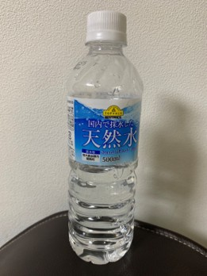
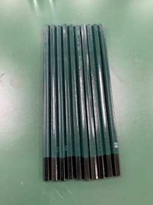
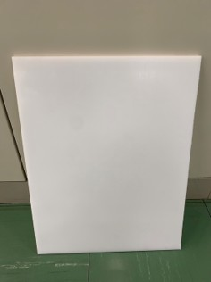
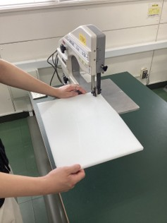
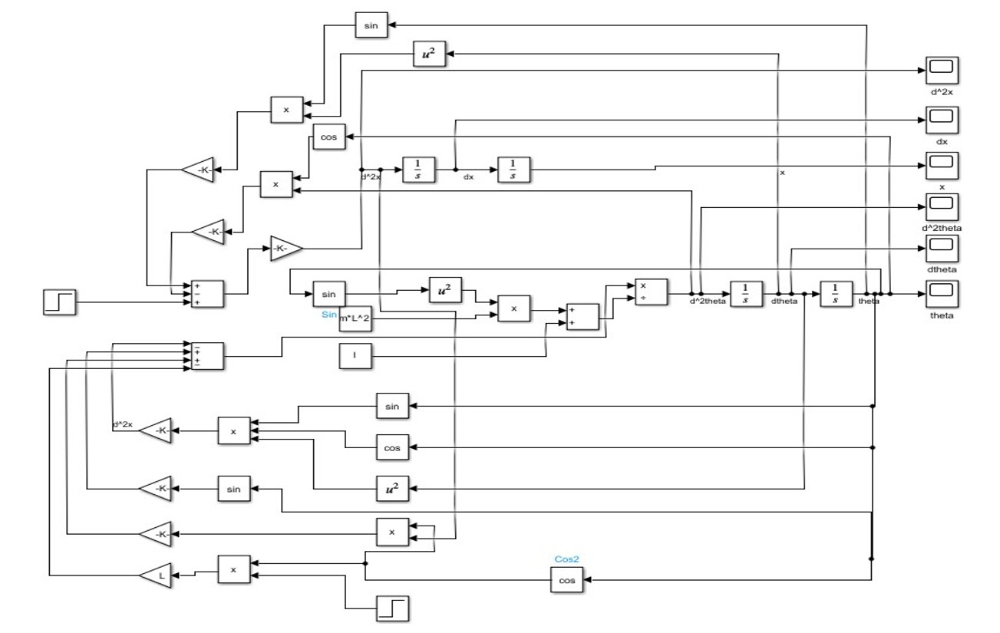
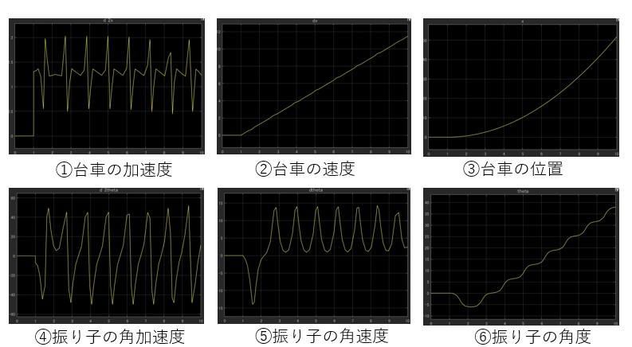
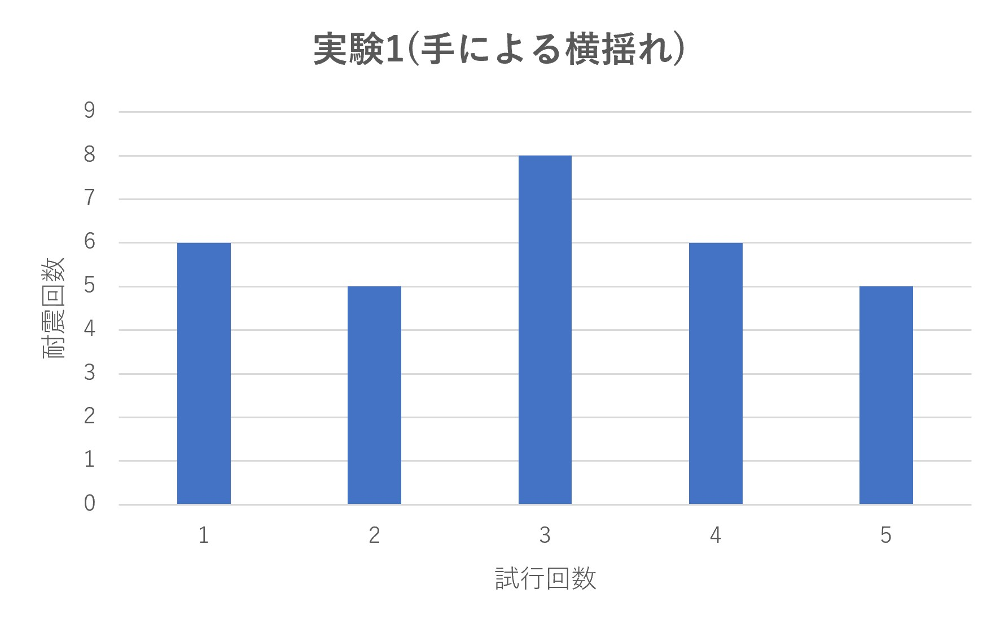
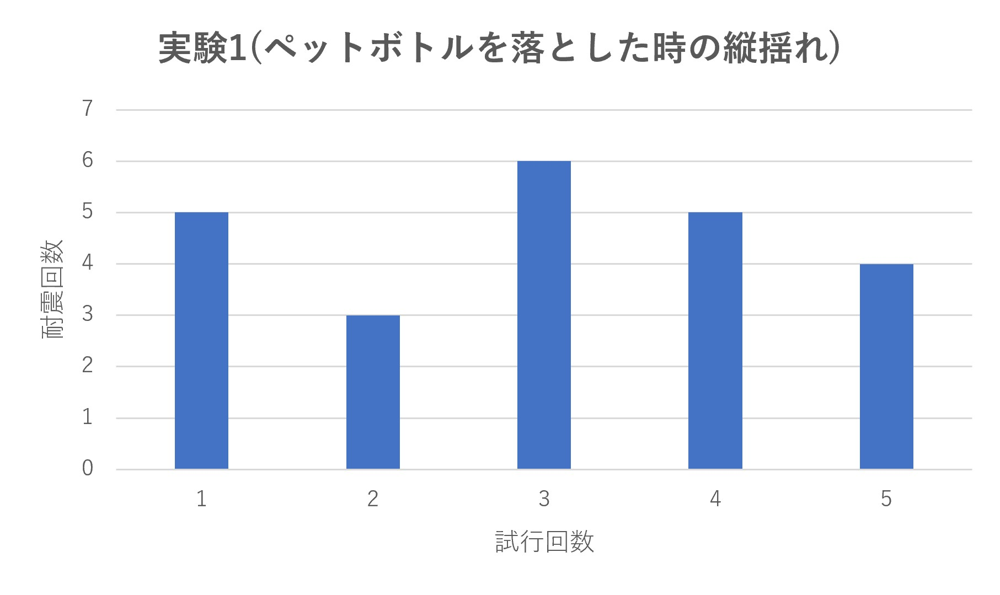
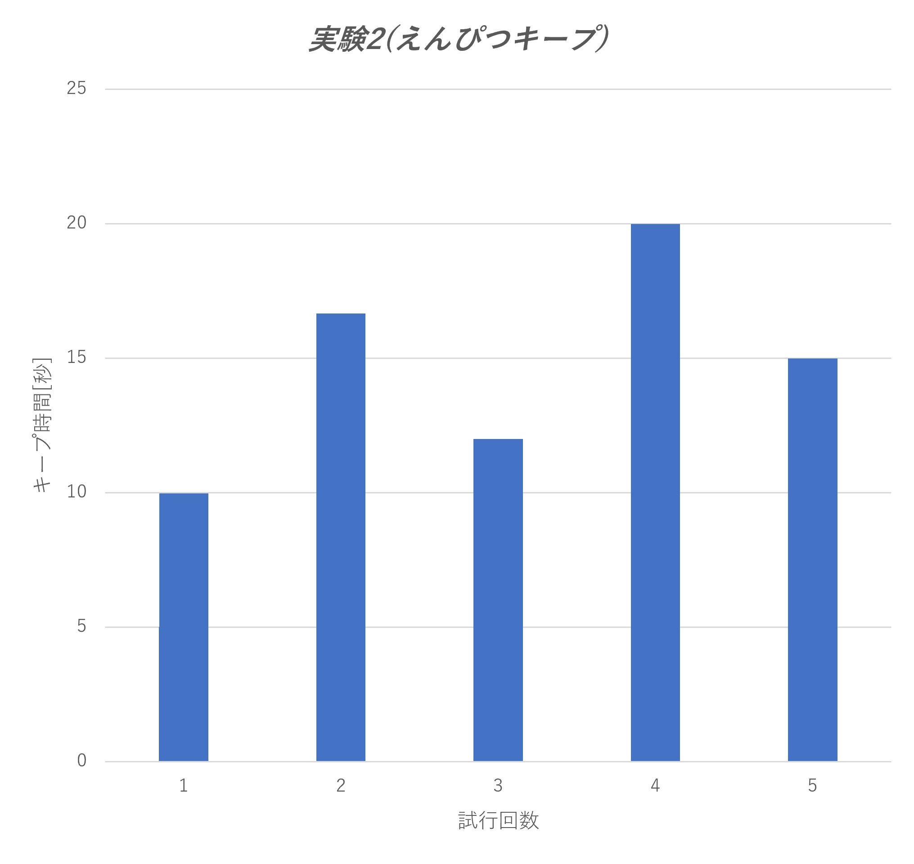

# Inverted_Pendulum_Robot
# 外乱に強い倒立振子ロボット

3台の台車型倒立振子ロボットで板を支え，外乱が加わっても板を水平に保つことを目指したプロジェクトです．
板の上にペットボトルや鉛筆を載せる実験を行い，横揺れ・縦揺れに対する耐震性と，長時間の安定制御を確認しました．

## デモ動画

| 実験                   | 動画                                                                                                                                   |
| -------------------- | ------------------------------------------------------------------------------------------------------------------------------------ |
| 実験1：ペットボトルを用いた外乱耐性実験 |  |
| 実験2：鉛筆を用いた安定制御実験     |  |

## 目的

本プロジェクトでは，倒立振子ロボットを用いて，倒立振子ロボットの外乱耐性(衝撃耐性)を評価しました．

具体的には，以下の2つを目標としました．

* 台車の上に板を乗せ，板の上にペットボトルを乗せても水平を保つ．
* 台車の上に板を乗せ，板の上に鉛筆を立てた状態を保つ．

## システム構成

3台の倒立振子ロボットを内側に向けて配置し，その上に板を乗せて制御を行いました．
板に外乱が加わった際，各台車が倒立制御を行うことで，板の水平状態を維持します．

## 使用物品

| 物品     | 内容                      |
| ------ | ----------------------- |
| ペットボトル | 300gのペットボトル1本           |
| 鉛筆     | 鉛筆10本                   |
| 板      | 重さ1.515kg，縦0.32m，横0.40m |
| 加工器具   | 帯のこ盤                    |

  
  

## 板の加工

板は帯のこ盤を用いて加工しました．
加工した板を3台の倒立振子ロボットの上に載せ，ペットボトルや鉛筆を用いた実験を行いました．

  
  

## 開発の流れ

| 工程             | 所要時間 |
| -------------- | ---- |
| 必要物品の購入        | 1日   |
| 部品の加工          | 1時間  |
| Simulinkモデルの作成 | 3日   |
| 倒立プログラムの作成     | 1週間  |
| 実機での実験         | 1週間  |

## Simulinkモデル

倒立振子の挙動を確認するため，Simulinkモデルを作成しました．
モデル上では，台車と振り子に関する以下の状態量を確認しました．

* 台車の加速度
* 台車の速度
* 台車の位置
* 振り子の角加速度
* 振り子の角速度
* 振り子の角度

  

  

## 制御プログラム

Simulinkモデルをもとに，実機で動作する倒立制御プログラムを作成しました．
ゲイン調整では，限界感度法を用いてPゲインを決定し，その後に他のゲインを少しずつ調整することで最適な値を探索しました．

## 実験1：ペットボトルを用いた外乱耐性実験

板の上にペットボトルを乗せ，横揺れと縦揺れを加えた際に，板を水平に保てるかを確認しました．
横揺れは手で揺らすことで与え，縦揺れはペットボトルを落としたときの衝撃として与えました．

  
  

### 結果

衝撃によって板が移動した場合でも，板を水平に保とうと制御できていることを確認しました．
実験結果は，複数回の試行に対して何回外乱に耐えられたかをまとめたものです．

[実験1の動画を見る](https://youtu.be/i9qChgvrjKQ)

## 実験2：鉛筆を用いた安定制御実験

板の上に鉛筆を立て，板を水平に保ちながら制御を継続できるかを確認しました．
鉛筆は板が水平に保たれていないと倒れてしまうため，鉛筆の保持時間を安定制御の指標としました．

  

### 結果

鉛筆が立っている状態を一定時間維持できたことから，板を水平に制御できていることを確認しました．
また，板だけを3台の機体で制御した場合には10分以上倒立したため，長時間の制御も可能であると判断しました．

[実験2の動画を見る](https://youtu.be/V-8VxSbRHfE)

## 結果のまとめ

2つの実験により，外乱に強く，長時間安定して制御できる倒立振子ロボットを実現できました．
特に，実験1では横方向・縦方向からの揺れに複数回耐えられることを確認し，実験2では板の水平状態を継続して保てることを確認しました．

## 補足

* 実験結果のグラフは，複数回の試行結果をまとめたものであり，結果の傾向や試行ごとの差を確認するために使用しました．
* 各機体の重さはモデリングに関係し，ゲイン調整時にも影響します．
* 台車をすべて同じ方向に向けた場合は，板を水平に保てる時間が短かったため，本実験では台車を内側に向けて配置しました．
